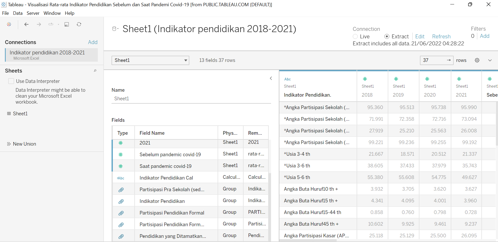
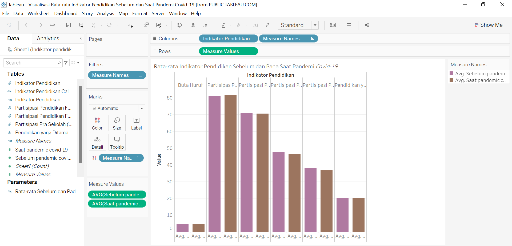
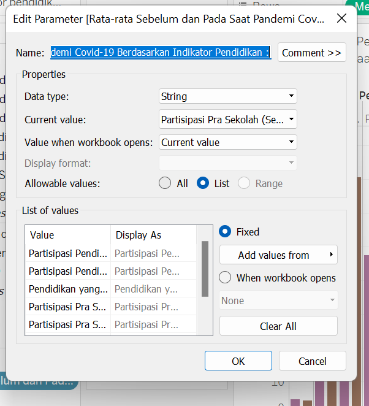
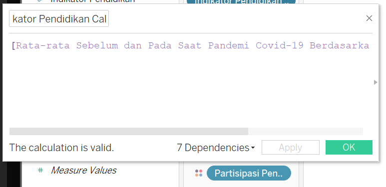
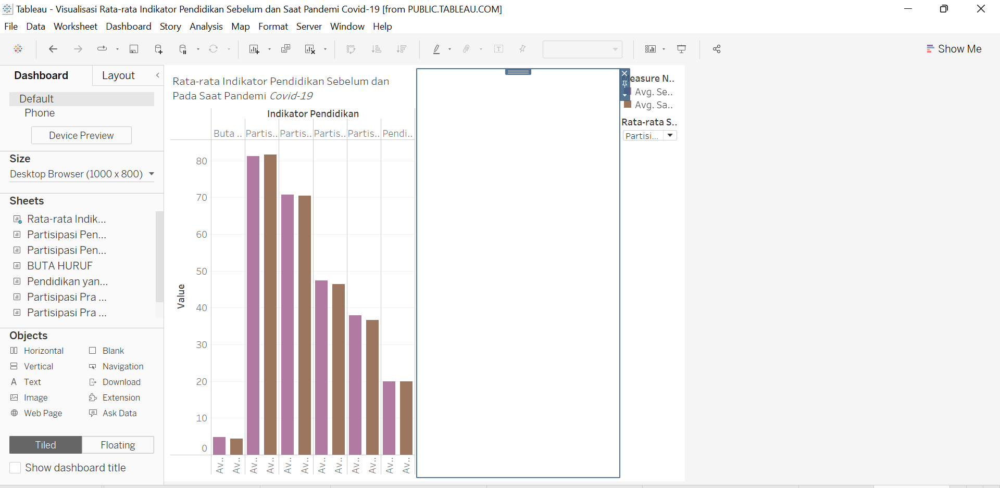
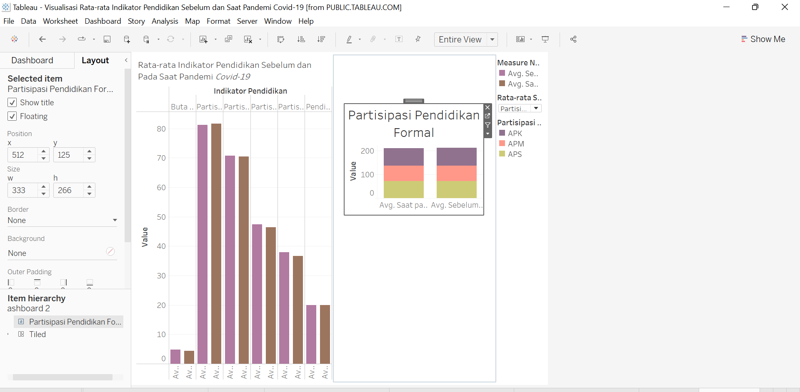
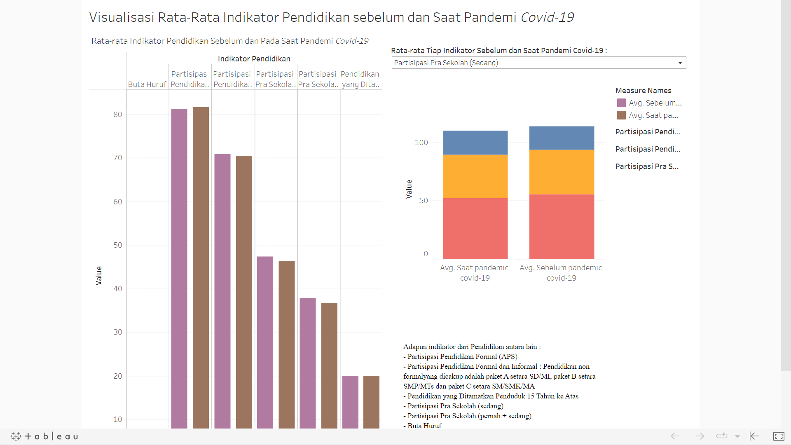

<!--
*** Thanks for checking out the Best-README-Template. If you have a suggestion
*** that would make this better, please fork the repo and create a pull request
*** or simply open an issue with the tag "enhancement".
*** Don't forget to give the project a star!
*** Thanks again! Now go create something AMAZING! :D
-->

<!-- PROJECT SHIELDS -->
<!--
*** I'm using markdown "reference style" links for readability.
*** Reference links are enclosed in brackets [ ] instead of parentheses ( ).
*** See the bottom of this document for the declaration of the reference variables
*** for contributors-url, forks-url, etc. This is an optional, concise syntax you may use.
*** https://www.markdownguide.org/basic-syntax/#reference-style-links
-->

<!-- ABOUT THE PROJECT -->
# Dashboard Visualisasi Rata-rata Indikator Pendidikan sebelum dan Saat Pandemi Covid-19

Pada 2 mei 2020 kasus Covid-19 yang pertama kali tercatat di Indonesia. Adanya pandemi Covid-19 berdampak signifikan terhadap kehidupan banyak orang. Pendidikan adalah suatu usaha sadar serta terencana utuk dapat mewujudkan suasana belajar dan proses pembelajaran supaya pesertadidik dengan secara aktif mengembangkan atau menggali potensi dirinya untuk bisa atau dapat mempunyai kekuatuan pengendalian diri, spiritual keagamaan, kecerdasan, akhlak mulia, kepribadian dan juga keterampilan yang diperlukan bagi dirinya, bagi masyarakat, bagi bangsa, dan bagi negara (UU No.20 Tahun 2003). Karena pandemi Covid-19 tersebut, banyak hal yang berubah, baik dari segi ekonomi, sosial, pendidikan dan bahkan budaya di masyarakat. Selama masa pandemi Covid-19, berbagai upaya telah dilakukan untuk mempertahankan kualitas pendidikan di Indonesia. 

## DATA
Data yang digunakan merupakan data indikator pendidikan 1994-2021 yang di peroleh dari BPS. 

Indikator Pendidikan beserta variabel-variabelnya:
* Partisipasi Pendidikan Formal (APS)
   - Angka Partisipasi Sekolah (APS) 7-12 th
   - Angka Partisipasi Sekolah (APS) 13-15 th
   - Angka Partisipasi Sekolah (APS) 16-18 th
   - Angka Partisipasi Sekolah (APS) 19-24 th
   - Angka Partisipasi Kasar (APK) SD/MI
   - Angka Partisipasi Kasar (APK) SMP/MTs
   - Angka Partisipasi Kasar (APK) SM/MA
   - Angka Partisipasi Kasar (APK) PT 19-24 th
   - Angka Partisipasi Murni (APM) SD/MI
   - Angka Partisipasi Murni (APM) SMP/MTs
   - Angka Partisipasi Murni (APM) SM/MA
   - Angka Partisipasi Murni (APM) PT 19-24 th
* Partisipasi Pendidikan Formal dan Informal
   - Angka Partisipasi Sekolah (APS) 7-12 th
   - Angka Partisipasi Sekolah (APS) 13-15 th
   - Angka Partisipasi Sekolah (APS) 16-18 th
   - Angka Partisipasi Sekolah (APS) 19-24 th
   - Angka Partisipasi Kasar (APK) SD/MI/Paket 
   - Angka Partisipasi Kasar (APK) SMP/MTs/Paket B
   - Angka Partisipasi Kasar (APK) SM/MA/Paket C
   - Angka Partisipasi Murni (APM) SD/MI/Paket 
   - Angka Partisipasi Murni (APM) SMP/MTs/Paket
   - Angka Partisipasi Murni (APM) SM/MA/Paket C

* Pendidikan yang Ditamatkan Penduduk 15 Tahun ke Atas
   - Tidak/belum sekolah
   - Tidak tamat SD
   - SD/sederajat
   - SMP/sederajat
   - SM +/sederajat
* Partisipasi Pra Sekolah (sedang)
  - Usia 3-4 th
   - Usia 5-6 th
   - Usia 3-6 th
* Partisipasi Pra Sekolah (pernah + sedang)
   - Usia 3-4 th
   - Usia 5-6 th
   - Usia 3-6 th
* Buta Huruf
   - Angka Buta Huruf10 th +
   - Angka Buta Huruf15 th +
   - Angka Buta Huruf15-44 th
   - Angka Buta Huruf45 th +

## Langkah-langkah Membuat Dashboard Visualisasi Rata-rata Indikator Pendidikan Sebelum dan Saat Pandemi Covid-19

1.	Prepare data
- Input data ke tableau 
Dengan langkah open tableau > (open file) pilih jenis data yang ini di input > open
-	Edit data
Memilih setiap indikator beserta variabel-variabel setiap indikator pada waktu 2018-2021 serta Menambahkan kolom pada data untuk rata-rata setiap variabel sebelum dan saat pandemi corona-19
-	Membuat group
Karna data yang tersedia berdasarkan variabel setiap indikator, maka dilakukan pengelompokan setiap variabel menurut indikatornya. Dan kelompok-kelompok yang dibutuhkan dalam visualisasi

  

2.	Membuat visualisasi data untuk rata-rata setiap indikator Pendidikan sebelum dan pada saat terjadi pandemi covid-19
-	Drag/input pada coloumns : Indikator Pendidikan. Measure Names
Indikator Pendidikan = variabel yang telah di kelompokkan berdasarkan indikatornya.
Measure Names = Average sebelum pandemi dan Average saat pandemi Covid-19.
-	Drag/Input pada rows : Measure values
Measure Values = Average sebelum pandemi dan Average saat pandemi Covid-19
-	Memilih visualisasi batang dan melakukan fixed untuk pewarnaan dll.

  

3.	Membuat visualisasi data untuk rata-rata setiap variable pada indikator Pendidikan sebelum dan pada saat terjadi pandemi covid-19.
Langkah-langkahnya sama seperti langkah-langkah pada Membuat visualisasi data untuk rata-rata setiap indikator Pendidikan sebelum dan pada saat terjadi pandemi covid-19. Hanya saja untuk input pada coloumns dan rows serta penampilan diagram batangnya disesuaikan.

4.	Membuat Parameter
-	Create Parameter
Kemudian input nama parameter serta values pada parameter

  

-	Create Calculate Fields untuk parameter yang  telah dibentuk

  

5.	Membuat Dashboard
Dashboard yang dibuat dibagi menjadi 2 sisi. Bagian kiri akan diisi oleh visualisasi data untuk rata-rata setiap indikator Pendidikan sebelum dan pada saat terjadi pandemi covid-19. Dan sebelah kananya akan menampilkan visualisasi rata-rata variable untuk setiap indikator pendidikan sebelum dan pada saat terjadi pandemi covid-19 pada bagan kanan.
-	Membagi layer dashboard menjadi 2 bagian

  

- Drag visualisasi rata-rata setiap indikator pendidikan sebelum dan pada saat terjadi pandemi covid-19 pada bagian kiri.
-Drag visualisasi rata-rata variable untuk indikator pendidikan sebelum dan pada saat terjadi pandemi covid-19 pada bagan kanan.
-	Atur bagian kanan agar dapat memuat semua visualisasi rata-rata variable untuk indikator pendidikan sebelum dan pada saat terjadi pandemi covid-19 dengan memilih floating pada selected item.
-	Lakukan langkah c dan d untuk setiap indikator pendidikan
- Lakukan editing untuk penamaan dan tata letak lainnya.

  

## Hasil Akhir

  

 [Hasil Akhir](https://public.tableau.com/app/profile/trigels.archelia.br.barus/viz/VisualisasiRata-rataIndikatorPendidikanSebelumdanSaatPandemiCovid-19/Dashboard1?publish=yes/)

- Pada visualisasi data untuk rata-rata setiap indikator pendidikan sebelum dan pada saat terjadi pandemi covid-19 dapat dilihat bahwa untuk setiap indikator kecuali indikator partisipasi pendidikan formal dan nonformal memiliki rata-rata yang lebih rendah pada saat pandemi covid-19.
- Pada visualisasi data untuk rata-rata setiap variable pada indikator partisipasi Pendidikan formal sebelum dan pada saat terjadi pandemi covid-19 tampak bahwa rata-rata setiap variabel kecuali variabel APM pada saat pandemi covid-19 lebih rendah daripada sebelum pandemi covid-19.
- Pada visualisasi data untuk rata-rata setiap variable pada indikator buta huruf sebelum dan pada saat terjadi pandemi covid-19 tampak bahwa rata-rata setiap variabel pada saat pandemi covid-19 lebih rendah daripada sebelum pandemi covid-19.
- Pada visualisasi data untuk rata-rata setiap variable pada indikator pendidikan yang ditamatkan penduduk 15 tahun ke atas sebelum dan pada saat terjadi pandemi covid-19 tampak bahwa rata-rata setiap variabel kecuali SM+/sederajat pada saat pandemi covid-19 lebih rendah daripada sebelum pandemi covid-19.
- Pada visualisasi data untuk rata-rata setiap variable pada indikator partisipasipasi pra sekolah (sedang) sebelum dan pada saat terjadi pandemi covid-19 tampak bahwa rata-rata setiap variabel kecuali usia 5-6 th pada saat pandemi covid-19 lebih tinggi daripada sebelum pandemi covid-19.
- Pada visualisasi data untuk rata-rata setiap variable pada indikator partisipasipasi pra sekolah (pernah + sedang) sebelum dan pada saat terjadi pandemi covid-19 tampak bahwa rata-rata setiap variabel kecuali usia 3-4 th pada saat pandemi covid-19 lebih rendah daripada sebelum pandemi covid-19.

<!-- CONTACT -->
## Contact

Trigels Archelia Br Barus  - 221911061@stis.ac.id

Project Link: [https://public.tableau.com/app/profile/trigels.archelia.br.barus/viz/VisualisasiRata-rataIndikatorPendidikanSebelumdanSaatPandemiCovid-19/Dashboard1?publish=yes/](https://public.tableau.com/app/profile/trigels.archelia.br.barus/viz/VisualisasiRata-rataIndikatorPendidikanSebelumdanSaatPandemiCovid-19/Dashboard1?publish=yes/)

(<a href="#top">back to top</a>)

